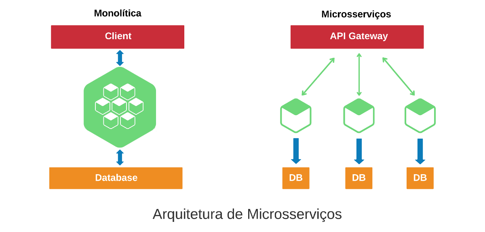

# microservices-springcloud

## 💬 Projeto

Construindo um ecossistema com arquitetura baseada em microsserviços usando spring cloud.

## Arquitetura padrão X Arquitetura de micro-serviços

- Todas as camadas separadas em micro-serviços
- Responsabilidades mais definidas
- 'Pedaços' do software independentes
- Camada UI (interface) atua como monolito

## 🛠️ Tecnologias utilizadas

- JAVA
- Spring Cloud
- Gradle

### Spring Cloud

Spring Cloud fornece ferramentas para desenvolvedores para construir rapidamente alguns dos padrões comuns em sistemas distribuídos (por exemplo, gerenciamento de configuração, descoberta de serviço, disjuntores, roteamento inteligente, micro-proxy, barramento de controle, tokens de uso único, bloqueios globais, eleição de liderança, distribuição sessões, estado do cluster). 

A coordenação de sistemas distribuídos leva a padrões de placa de caldeira e, usando o Spring Cloud, os desenvolvedores podem criar rapidamente serviços e aplicativos que implementam esses padrões. Eles funcionarão bem em qualquer ambiente distribuído, incluindo o próprio laptop do desenvolvedor, data centers bare metal e plataformas gerenciadas, como Cloud Foundry.
